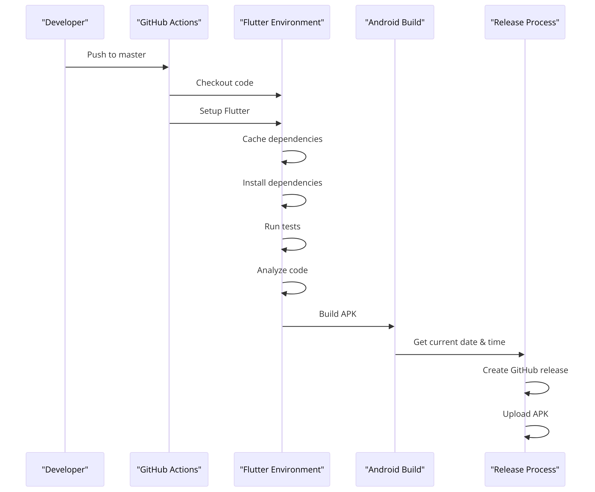

# Flutter App CI/CD Pipeline

## Project Overview

This project showcases a comprehensive CI/CD pipeline designed for a cross-platform Flutter application, automated through GitHub Actions. Aimed at demonstrating proficiency in automating build, test, and release processes, this pipeline is integrated with Artifactory for efficient artifact management. The successful implementation highlights a robust strategy for continuous integration and continuous delivery.

## CI/CD Pipeline Status Badges

## Setting Up the Local Development Environment

- **Flutter Installation on macOS (Silicon Chip)**: Followed the official Flutter installation guide for macOS, ensuring compatibility with the Silicon chip architecture. This setup was crucial for local app development and testing. Reference: [Flutter macOS installation guide](https://docs.flutter.dev/get-started/install/macos/desktop).

- **Development Tool**: The entire development process, including app creation and testing, was conducted in Visual Studio Code, a versatile editor for Flutter app development.

## Repository and Branching Strategy

- A new GitHub repository was created to host the Flutter application codebase.
- Development was carried out on a separate branch, named `master`, where the Flutter application was initialized and tested locally.

## Local App Testing

- **Dependency Management**: Ran `flutter pub get` to successfully fetch all necessary dependencies.
- **Code Analysis**: Executed `flutter analyze` with zero errors found, ensuring code quality.
- **App Testing**: Launched the application using `flutter run` to test functionality in Chrome and macOS environments, confirming the app's correct behavior on different platforms.

## CI Pipeline Configuration

- **Pipeline File**: Created `.github/workflows/flutter_pipeline.yml` to define the CI pipeline, automating the build and test phases for the application.
- **Testing Challenges**: Initially unsure of the testing suite beyond `flutter analyze`, research was conducted to identify and implement comprehensive testing strategies.
- **Parallel Testing**: Explored options for parallel step execution within a job to optimize the testing phase, employing a matrix strategy for platform-specific tests.
- **Flutter Upgrade**: Faced and resolved an issue with Flutter version compatibility between the application and the GitHub Actions environment.
- **Integration Testing**: Developed and refined a basic integration test for iOS and macOS platforms, addressing errors and improving the CI pipeline's efficiency by consolidating tests into a single job.

## CI Pipeline Optimization

- **Caching Strategy**: Investigated and implemented effective caching mechanisms for the workflow, reducing build times and enhancing pipeline performance.

## Documentation and Release Management

- **README Documentation**: Crafted a detailed README file with CI status badges, offering clarity on the project's CI/CD pipeline and setup instructions.
- **Release Strategy**: Ensured accurate release tagging and asset management, facilitating clear and accessible distribution of build artifacts.

## CI Workflow Diagram

Below is a simplified diagram illustrating the CI workflow:

1. **Push to `master`**: Trigger the CI pipeline on push events.
2. **Checkout Code**: Fetch the latest code from the repository.
3. **Install Dependencies**: Execute `flutter pub get`.
4. **Code Analysis and Tests**: Run `flutter analyze` and `flutter test`.
5. **Build Application**: Perform `flutter build apk --release` for Android.
6. **Create and Upload Release**: Automatically generate a release tag based on the current date and time, uploading the Android APK to GitHub Releases.

A concise diagram illustrating the CI process is provided below to encapsulate the workflow and highlight the pipeline's operational framework.

